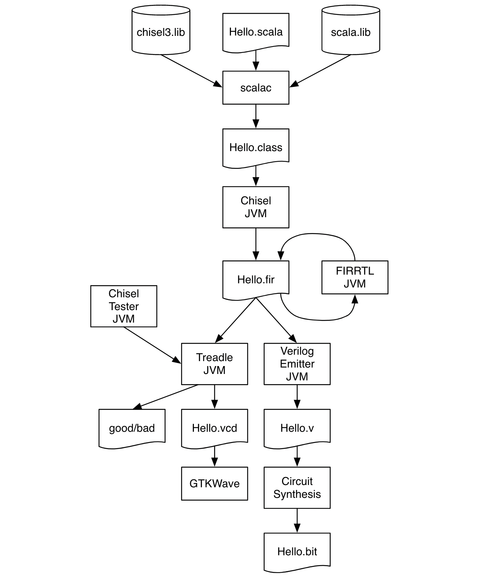

# Rocket Chip 修改日志

## 4.15

编译运行 emulator 报错 `/usr/bin/env: ‘python’: No such file or directory`，安装 `python-is-python3` 可以解决。

## 4.14

先确保可以正常编译和仿真后搭建项目开发环境：使用 IDEA 作为 rocket chip 的编辑器，目前可以很好地支持代码跳转、代码补全等功能；
打开 IDEA 后选择从已存在的源代码中创建工程，选择代码根目录下的 build.sbt 文件，在 Import Project 对话框中选择 Library sources、sbt sources、project reload、builds、Allow overriding sbt version，JDK 版本选择 8，Launcher 选择 Custom 并选中代码根目录下的 sbt-launch.jar。

### 截至目前的项目组织

在使用此项目前应该确保 riscv 工具链已经安装好，推荐在 Ubuntu20.04 上进行开发。

- `common`：和 uintr 相关的 scala 代码，以及一些公共的构建脚本，参考自 zynq-fpga 等项目：
  - `Makefrag`：公共的构建脚本，会被开发版文件夹引用；
  - `build.sh`：参考自 rocket-tools ，用于编译和安装 tests 和 spike，因为这两个子模块可能有我们自己的改动；
- `rocket-chip`：作为子模块指向 v1.6 版本的 rocket-chip 项目，这是 fork 后绑定的版本；
- `spike`：作为子模块指向最新版的 riscv-isa-sim 项目；指令级别的模拟器，暂时不会修改这个模拟器，因为可以跑裸汇编并查看波形确保正确性，且硬件设计的规模不是很大；
- `tests`：作为子模块指向最新版的 riscv-tests 项目，主要在这个项目中添加 uintr 的汇编测例；
- `zcu102`：zcu102 开发板相关配置，包括引脚绑定、时钟配置、block design 项目生成脚本等；

阅读 chisel 入门手册，重温了一遍硬件开发规则，方便之后阅读 Rocket Chip 源码，主要关注：

- 复杂的 FSM
- 如何使用 FPGA 上自带的 Block RAM
- 符号约定、变量约定等

### riscv-tests

在 rocket chip 中跑某个测例的仿真：`make output/rv64ui-p-add.out` 和 `make output/rv64ui-p-add.vcd`

riscv 测例主要按特权级和指令模块进行分类，U 态运行的是基本指令测试，S 态和 M 态运行的大多数是一些和 CSR 、特权指令相关的测试；前缀中带有字母 `p` 表示不开虚存，且只有 0 号核被启动，`v` 表示开虚存。

参考已有的测例，编写 N 扩展的测例，目前编译器已经支持 U 态的 CSR 和 uret ：

```asm
#include "riscv_test.h"
#include "test_macros.h"

RVTEST_RV64S
RVTEST_CODE_BEGIN

  TEST_CASE(0, a0, 3, csrwi uscratch, 3; csrr a0, uscratch);
  TEST_CASE(1, a0, 3, csrwi utvec, 3; csrr a0, utvec);
  TEST_CASE(2, a0, 3, csrwi utval, 3; csrr a0, utval);
  TEST_CASE(3, a0, 3, csrwi uepc, 3; csrr a0, uepc);
  li a1, MIP_USIP;
  TEST_CASE(4, a0, 1, csrsi uip, IRQ_U_SOFT; csrr a0, uip; and a0, a0, a1);
  TEST_CASE(5, a0, 1, csrsi uie, IRQ_U_SOFT; csrr a0, uie; and a0, a0, a1);
  TEST_CASE(6, a0, 1, csrsi sideleg, IRQ_U_SOFT; csrr a0, sideleg; and a0, a0, a1);

  # jump to user land
  li t0, SSTATUS_SPP
  csrc sstatus, t0
  la t0, 1f
  csrw sepc, t0
  # setup user interrupt handler
  csrw uepc, t0
  la t0, utvec_handler
  csrw utvec, t0
  sret
  1:
  
finish:
  TEST_CASE(7, a0, 0xdead, lw a0, result);
  RVTEST_PASS

  # We should only fall through to this if scall failed.
  TEST_PASSFAIL

.align 2
  .global utvec_handler
utvec_handler:
  li t0, 0xdead
  la t1, result
  sw t0, 0x0(t1)
  uret

RVTEST_CODE_END

  .data
RVTEST_DATA_BEGIN
  .align 3
result:
  .dword 0
RVTEST_DATA_END
```

查看 `output/rv64sn-p-csr.out`：

```log
C0:      20260 [0] pc=[00000000800001ac] W[r 0=0000000000000000][0] R[r 0=0000000000000000] R[r 0=0000000000000000] inst=[0401d073] csrwi   unknown_040, 3
```

由于 rocket chip 里面还没有实现，运行到第一个测例就抛出异常了。

## 4.10

Rocket Chip 在 emulator 中执行出现问题，报错找不到 `std::optional`。原因参见 [issue#3225](https://github.com/chipsalliance/rocket-chip/issues/3225) 。可能是 rocket-tools 版本不匹配，新版的 spike 用了 C++17 的特性，而 verilator 里面 `CFG_CXXFLAGS_STD_NEWEST` 根据 Linux 的版本设置，需要手动更改为 C++17，参见 [pull#3226](https://github.com/chipsalliance/rocket-chip/pull/3226)，这个 Commit 将 Verilator 的版本更新到了 4.226 并跟踪了新版的 spike 。

Chisel Build 和 Test 的流程：

- The digital circuit is described in a Chisel class shown as Hello.scala.
- The Scala compiler compiles this class, together with the Chisel and Scala libraries, and generates the Java class Hello.class that can be executed by a standard Java virtual machine (JVM).
- Executing this class with a Chisel driver generates the so-called flexible intermediate representation for RTL (FIRRTL), an intermediate representation of digital circuits. The FIRRTL compiler performs transformations on the circuit.
- Treadle is a FIRRTL interpreter to simulate the circuit. Together with the Chisel tester it can be used to debug and test Chisel circuits. With assertions we can provide test results. Treadle can also generate waveform files (Hello.vcd) that can be viewed with a waveform viewer (e.g., the free viewer GTKWave or Modelsim).
- One FIRRTL transformation, the Verilog emitter, generates Verilog code for synthesis (Hello.v). A circuit synthesize tool (e.g., Intel Quartus, AMD/Xilinx Vivado, or an ASIC tool) synthesizes the circuit. In an FPGA design flow, the tool generates the FPGA bitstream that is used to configure the FPGA, e.g., Hello.bit.



## 4.6

git submodule 相关指令：

- `git diff --cached --submodule`：查看子模块的更改
- `git fetch && git merge origin/master`：手动从上游分支拉取修改，合并分支
- `git submodule update --remote`：子模块自动抓取与更新
- `git config -f .gitmodules submodule.Submodule.branch stable`：子模块跟踪仓库的其他分支
- `git config status.submodulesummary`：显示子模块的更改摘要

参照 RISC-V 工具链的配置过程，新建项目 `uintr-rocket-chip`，将 rocket-chip ，spike，riscv-tests 等项目作为子模块导入。

Spike 是指令级别的仿真器，需要对 Spike 进行修改来支持 RISC-V 用户态中断。

安装 Vivado2017.1 发现貌似可以在 Ubuntu 20.04 上正常运行，输出：

```txt
ERROR: [17-356] Failed to install all user apps. 
```

执行 `vivado -mode tcl` 并在命令行输入 `tclapp::reset_tclstore` ，重启 vivado 即可。

在 `rc-fpga-zcu` 里面尝试 `make bitstream` ，出现找不到 device 的报错，原因可能是 Vivado2017.1 不支持 zcu102 ？

最后将 Vivado2017.1 升级为完整版，可以正常生成比特流，可以进入图形界面看到 block design 。

## 4.5

发现 litex 项目，可以仿真 vecriscv 并运行 Linux ，按照仓库内的提示配置环境后执行 `./sim.py` 会卡在 Linux 启动。

该项目号称支持 zcu102 ，并没有相关的演示，理想的方案是 Litex + Rocket Chip 仿真 Linux 后直接在 zcu102 上完成测试。

Rocket Chip 目前可以在搭建好的 docker 容器进行仿真，对 riscv-tests 进行分析并编写指令测例（UIPI 指令和读写外设）

## 4.4

先安装 [rocket-tools](https://github.com/chipsalliance/rocket-tools)，由于之前已经安装过 riscv-gnu-toolchain ，只能参考脚本手动安装仓库包含的项目：

- [x] riscv-isa-sim：Spike 模拟器
- [x] riscv-tests：RISC-V 处理器的单元测试
- [x] riscv-openocd：硬件调试，目前对这方面不太了解
- [x] riscv-pk：Proxy Kernel，pk 可以执行静态 ELF，提供 bbl 用来引导 RISC-V Linux
- [x] riscv-gnu-toolchain：RISC-V 工具链，需要 riscv-unknown-elf 和 riscv-unknown-linux-gnu

工具链的 submodule 拉取太慢，把里面的部分 url 改成 tuna 镜像源。

最后执行 `tar -zcvf rocket-tools.tar.gz riscv-gnu-toolchain riscv-isa-sim riscv-openocd riscv-pk riscv-tests build.sh` 这样就不需要每次都 clone 了。

勉强安装成功后，Rocket Chip 切到 v1.6 也就是最新的 release 版本， emulator 里尝试 make，报错找不到头文件，查看相关 [issue](https://github.com/chipsalliance/rocket-chip/issues/2766) 发现是 bison 版本过高导致的，然而我的电脑是 Ubuntu 22.04 版本，默认安装的 bison 就是 3.8.2，只能想其他办法。

学习 Docker 构建和开发流程，编写 Dockerfile ，由于仓库拉取比较麻烦，选择先在 clone 到本地，然后在 Dockerfile 中全都 COPY 进去构建，构建脚本 build.sh 来自 rocket-tools 这个官方仓库：

```docker
FROM ubuntu:20.04

# Set tzdata noninteractive
ENV DEBIAN_FRONTEND=noninteractive

# Install packages
RUN apt-get update \
    && apt-get install -y git vim wget fish autoconf automake \
    autotools-dev curl libmpc-dev libmpfr-dev \
    libgmp-dev libusb-1.0-0-dev gawk build-essential \
    bison flex texinfo gperf libtool patchutils bc \
    zlib1g-dev device-tree-compiler pkg-config \
    libexpat-dev libfl-dev gnutls-bin \
    openjdk-8-jre openjdk-8-jdk

# RISC-V tools
ENV RISCV=/root/riscv

ENV PATH=$PATH:$RISCV/bin

WORKDIR /root

# Build default tools (pre-cloned and copied from local working directory)
ADD rocket-tools.tar.gz tools
RUN cd tools && chmod +x build.sh && ./build.sh \
    && cd riscv-gnu-toolchain/build \
    && make linux -j $(nproc) \
    && make install

# Clean repos
RUN rm -rf tools

# Install sbt
RUN curl -fL https://github.com/coursier/coursier/releases/latest/download/cs-x86_64-pc-linux.gz \
    | gzip -d > cs && chmod +x cs && ./cs setup -y
```

执行 `docker build -t rocket -f Dockerfile --progress=plain . 2>&1 | tee build.log` 构建镜像，用时一个下午构建成功。执行 `docker image ls -a` 查看当前镜像，需要将该镜像 push 到 Docker Hub。执行 `docker login && docker tag rocket tkf2023/images:v1 && docker push tkf2023/images:v1` 成功将镜像上传至仓库。

Docker 清理：

- ‵docker system prune --volumes`
- `docke` container prune`：删除状态为 exited 的容器
- `docker rm -f $(docker ps -aq)`：删除所有容器
- `docker image ls -f dangling=true`：列出所有镜像（包含中间层、被容器使用的镜像）
- `docker image rm $(docker image ls -f dangling=true)`：删除所有镜像
。
