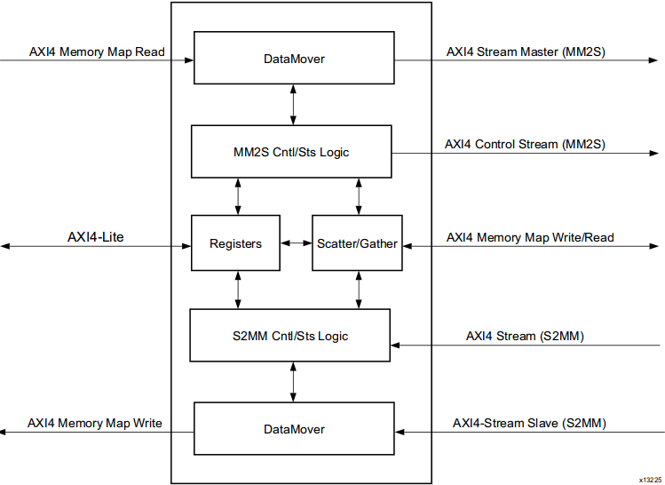
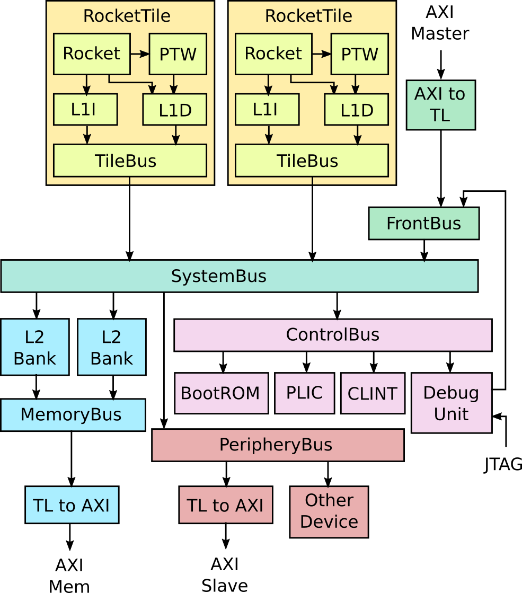

### 10.22

#### Rocket chip


We don't have access to VCS simulator, but we can generate the synthesizable Verilog file with the commands:

```sh
make verilog CONFIG=freechips.rocketchip.system.DefaultFPGAConfig
```

The target Verilog will be generated in directory `vsim/generated-src`. What we need to know is how the `DefaultFPGAConfig` works. See `vsim/Makefrag-verilog` and keep tracking on all Makefile variables.

```Makefile
# Prepare for sbt and java environment
SBT ?= java -Xmx$(JVM_MEMORY) -Xss8M -jar $(base_dir)/sbt-launch.jar
JAVA ?= java -Xmx$(JVM_MEMORY) -Xss8M
FIRRTL ?= $(JAVA) -cp $(ROCKET_CHIP_JAR) firrtl.stage.FirrtlMain
GENERATOR ?= $(JAVA) -cp $(ROCKET_CHIP_JAR) $(PROJECT).Generator

# List all resource files in Rocket Chip project.
scala_srcs := $(shell find $(base_dir) -name "*.scala" -o -name "*.sbt")
resource_dirs := $(shell find $(base_dir) -type d -path "*/src/main/resources")
resources := $(foreach d,$(resource_dirs),$(shell find $(d) -type f))
all_srcs := $(scala_srcs) $(resources)

# Get rocket chip .jar file
ROCKET_CHIP_JAR := $(base_dir)/rocketchip.jar
$(ROCKET_CHIP_JAR): $(all_srcs)
	cd $(base_dir) && $(SBT) assembly

# Use pre-generated bootrom image
bootrom_img = $(base_dir)/bootrom/bootrom.img

# We need to change the CONFIG mannually
$(generated_dir)/%.fir $(generated_dir)/%.d: $(ROCKET_CHIP_JAR) $(bootrom_img)
	mkdir -p $(dir $@)
	cd $(base_dir) && $(GENERATOR) -td $(generated_dir) -T $(PROJECT).$(MODEL) -C $(CONFIG)

$(generated_dir)/%.v $(generated_dir)/%.conf: $(generated_dir)/%.fir $(ROCKET_CHIP_JAR)
	mkdir -p $(dir $@)
	$(FIRRTL) -i $< \
    -o $(generated_dir)/$*.v \
    -X verilog \
    --infer-rw $(MODEL) \
    --repl-seq-mem -c:$(MODEL):-o:$(generated_dir)/$*.conf \
    -faf $(generated_dir)/$*.anno.json \
    -td $(generated_dir)/$(long_name)/ \
    -fct $(subst $(SPACE),$(COMMA),$(FIRRTL_TRANSFORMS)) \
```

In conclusion, what we should prepare is:

- A bootrom image to load device tree and boot system softwares (uboot, linux). Maybe we can use RustSBI or OpenSBI instead.
- A device tree to let the generator know what the zcu102 board looks like
- A configuration written in Chisel and passed to the generator while building .fir file, which can be found in `src/main/scala/system`.

#### Build Rocket (default configs)

- First we need build [riscv-gnu-toolchain](https://github.com/riscv-collab/riscv-gnu-toolchain): run `./configure --prefix=/opt/riscv; make` to install `riscv64-unknown-elf-*` tools.
  - You might need to refer to the [README.md](https://github.com/riscv-collab/riscv-gnu-toolchain/README.md) to install dependencies.
- Set `RISCV` environment variable in your workspace. E.g. run `echo "export RISCV=/opt/riscv/; export PATH=$RISCV/bin:$PATH;" >> ~/.bashrc` to set it global.
- Get [riscv-tools](https://github.com/riscv-software-src/riscv-tools) and build it. E.g. run `sudo RISCV=/opt/riscv bash -c ./build.sh` because the toolchain is installed under a directory which can be modified only with root permission.
  - See [this issue](https://github.com/riscv-software-src/riscv-tests/issues/286): add `-fcommon` to `RISCV_GCC_OPTS` because cuurent version of gcc compilers sets `-fno-common` by default.

### 10.27

#### Build Labeled-RISC-V-N on zcu102

- Install vivado 2020.2
- Build Labeled-RISC-V-N with `.v`s generated by modified Rocket Chip and block design by existing `.tcl` scripts.

### 10.31~11.1

#### Learn MPSOC

- **PS**: ARM cores; **PL**: FPGA
- AXI DMA:
  - 2 channels: memory mapped to stream (mm2s) and stream to memory mapped (s2mm)
  - AXI Memory Mapped: For DDR data. (write address channel, write data channel, write response channel, read address channel, read data channel).
  - AXI Lite: For configuring registers.
  - AXI Stream: Writes or reads peripherals.
  - `M_AXI_MM2S`: DMA reads data from DDR.
  - `M_AXI_S2MM`: DMA writes data to DDR.
  - `M_AXIS_MM2S`: DMA writes data to stream interface.
  - `S_AXIS_S2MM`: DMA reads data from stream interface.
  - `mm2s_introut`: (Interrupt) reads from DDR and writes to stream interface.
  - `s2mm_introut`: (Interrupt) reads from stream interface and writes to DDR.




#### Learn Rocket

More details in **[chipyard](https://chipyard.readthedocs.io/en/stable/index.html)**.

- RocketTile:
  - Rocket Core: can be swapped for a BOOM core.
  - PTW: Page Table Walker is seperated from the main logic of Rocket Core.
  - L1 Cache:
    - L1 I$
    - L1 D$
  - TileBus
- SystemBus: the TileLink network that sits between the tiles and the L2 agents and MMIO peripherals.
- ControlBus: connects standard peripherals like BootRom, PLIC, CLINT and the Debug Unit.
  - BootROM: contains first stage bootloader and device tree.
  - PLIC: aggregates and masks device interrupts and external interrupts.
  - CLINT: contains software interrupts and timer interrupts for CPU.
  - Debug: can be used to load data or instructions to memory or pull data from memory.
- PeripheryBus: connects additional peripherals like the NIC and Block Device.



#### How to edit Rocket in IDEA (Linux)

- Download the newest version of [IDEA](https://www.jetbrains.com/idea/download/download-thanks.html?platform=linux)
- Activate IDEA using code in this [blog](https://www.ajihuo.com/idea/4222.html).
- Clone the repository and build Rocket to make sure that you can generate verilog files successfully.
- Open the sbt project (root directory of Rocket) in IDEA and you can see sbt settings. (If not, try `Ctrl+Alt+S` and search sbt for settings tab). 
- Select Custom Launcher and set `rocket-chip/sbt-launch.jar` as the source file. **DO NOT** select `Download: library sources` or `Download: sbt sources`.
- I use following version of java. Others may be OK.

```txt
openjdk version "1.8.0_342"
OpenJDK Runtime Environment (build 1.8.0_342-8u342-b07-0ubuntu1~20.04-b07)
OpenJDK 64-Bit Server VM (build 25.342-b07, mixed mode)
```

### 11.2

#### Labeled SOC

- Two block designs, `pardcore` and `zynqsoc` are wrapped together by a top module in `system_top.v`.
- AXI interfaces between them are mapped through `address_mapper.v`. E.g. Rocket M_AXI_MEM is mapped from `[0x1_0000_0000, 0x1_8000_0000)` to `[0x8_0000_0000, 0x8_8000_0000)`.
- Main interfaces exposed by Rocket or `pardcore` are listed below:
  - Jtag interfaces (optional)
  - Led (pin connected)
  - M_AXI_MEM: 0x1_0000_0000, 2G
  - M_AXI_MMIO: 0x4000_0000, 1G
  - S_AXI_DMA: frontend bus to L2 Cache, 0x0, 8G

```scala
class LvNAFPGATop(implicit p: Parameters) extends ExampleRocketSystem
    with HasControlPlane
    with BindL2WayMask
{
  override lazy val module = new LvNAFPGATopModule(this)
}

class LvNAFPGATopModule[+L <: LvNAFPGATop](_outer: L) extends ExampleRocketSystemModuleImp(_outer)
    with HasControlPlaneModuleImpl
    with BindL2WayMaskModuleImp
```

- `LvNAFPGATop` extends existing module `ExampleRocketSystem` with two traits:
  - `HasControlPlane`: 
  - `BindL2WayMask`: 

