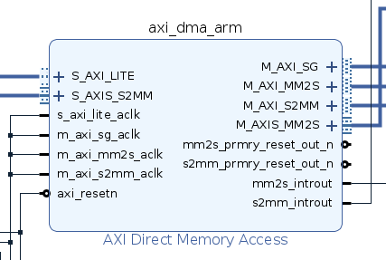
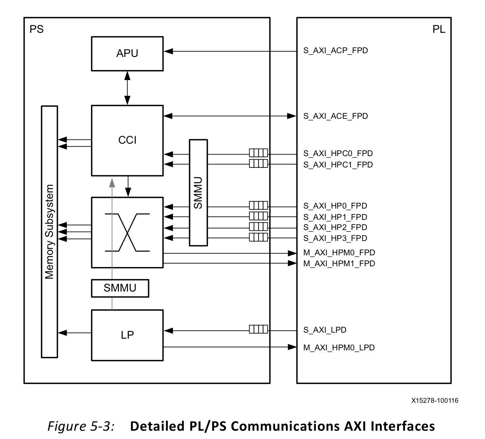

### 10.22

#### Rocket chip


We don't have access to VCS simulator, but we can generate the synthesizable Verilog file with the commands:

```sh
make verilog CONFIG=freechips.rocketchip.system.DefaultFPGAConfig
```

The target Verilog will be generated in directory `vsim/generated-src`. What we need to know is how the `DefaultFPGAConfig` works. See `vsim/Makefrag-verilog` and keep tracking on all Makefile variables.

```Makefile
# Prepare for sbt and java environment
SBT ?= java -Xmx$(JVM_MEMORY) -Xss8M -jar $(base_dir)/sbt-launch.jar
JAVA ?= java -Xmx$(JVM_MEMORY) -Xss8M
FIRRTL ?= $(JAVA) -cp $(ROCKET_CHIP_JAR) firrtl.stage.FirrtlMain
GENERATOR ?= $(JAVA) -cp $(ROCKET_CHIP_JAR) $(PROJECT).Generator

# List all resource files in Rocket Chip project.
scala_srcs := $(shell find $(base_dir) -name "*.scala" -o -name "*.sbt")
resource_dirs := $(shell find $(base_dir) -type d -path "*/src/main/resources")
resources := $(foreach d,$(resource_dirs),$(shell find $(d) -type f))
all_srcs := $(scala_srcs) $(resources)

# Get rocket chip .jar file
ROCKET_CHIP_JAR := $(base_dir)/rocketchip.jar
$(ROCKET_CHIP_JAR): $(all_srcs)
	cd $(base_dir) && $(SBT) assembly

# Use pre-generated bootrom image
bootrom_img = $(base_dir)/bootrom/bootrom.img

# We need to change the CONFIG mannually
$(generated_dir)/%.fir $(generated_dir)/%.d: $(ROCKET_CHIP_JAR) $(bootrom_img)
	mkdir -p $(dir $@)
	cd $(base_dir) && $(GENERATOR) -td $(generated_dir) -T $(PROJECT).$(MODEL) -C $(CONFIG)

$(generated_dir)/%.v $(generated_dir)/%.conf: $(generated_dir)/%.fir $(ROCKET_CHIP_JAR)
	mkdir -p $(dir $@)
	$(FIRRTL) -i $< \
    -o $(generated_dir)/$*.v \
    -X verilog \
    --infer-rw $(MODEL) \
    --repl-seq-mem -c:$(MODEL):-o:$(generated_dir)/$*.conf \
    -faf $(generated_dir)/$*.anno.json \
    -td $(generated_dir)/$(long_name)/ \
    -fct $(subst $(SPACE),$(COMMA),$(FIRRTL_TRANSFORMS)) \
```

In conclusion, what we should prepare is:

- A bootrom image to load device tree and boot system softwares (uboot, linux). Maybe we can use RustSBI or OpenSBI instead.
- A device tree to let the generator know what the zcu102 board looks like
- A configuration written in Chisel and passed to the generator while building .fir file, which can be found in `src/main/scala/system`.

#### Build Rocket (default configs)

- First we need build [riscv-gnu-toolchain](https://github.com/riscv-collab/riscv-gnu-toolchain): run `./configure --prefix=/opt/riscv; make` to install `riscv64-unknown-elf-*` tools.
  - You might need to refer to the [README.md](https://github.com/riscv-collab/riscv-gnu-toolchain/README.md) to install dependencies.
- Set `RISCV` environment variable in your workspace. E.g. run `echo "export RISCV=/opt/riscv/; export PATH=$RISCV/bin:$PATH;" >> ~/.bashrc` to set it global.
- Get [riscv-tools](https://github.com/riscv-software-src/riscv-tools) and build it. E.g. run `sudo RISCV=/opt/riscv bash -c ./build.sh` because the toolchain is installed under a directory which can be modified only with root permission.
  - See [this issue](https://github.com/riscv-software-src/riscv-tests/issues/286): add `-fcommon` to `RISCV_GCC_OPTS` because cuurent version of gcc compilers sets `-fno-common` by default.

### 10.27

#### Build Labeled-RISC-V-N on zcu102

- Install vivado 2020.2
- Build Labeled-RISC-V-N with `.v`s generated by modified Rocket Chip and block design by existing `.tcl` scripts.

### 10.31~11.1

#### Learn MPSOC

- **PS**: ARM cores; **PL**: FPGA
- AXI DMA:
  - 2 channels: memory mapped to stream (mm2s) and stream to memory mapped (s2mm)
  - AXI Memory Mapped: For DDR data. (write address channel, write data channel, write response channel, read address channel, read data channel).
  - AXI Lite: For configuring registers.
  - AXI Stream: Writes or reads peripherals.
  - `M_AXI_MM2S`: DMA reads data from DDR.
  - `M_AXI_S2MM`: DMA writes data to DDR.
  - `M_AXIS_MM2S`: DMA writes data to stream interface.
  - `S_AXIS_S2MM`: DMA reads data from stream interface.
  - `mm2s_introut`: (Interrupt) reads from DDR and writes to stream interface.
  - `s2mm_introut`: (Interrupt) reads from stream interface and writes to DDR.




#### Learn Rocket

More details in **[chipyard](https://chipyard.readthedocs.io/en/stable/index.html)**.

- RocketTile:
  - Rocket Core: can be swapped for a BOOM core.
  - PTW: Page Table Walker is seperated from the main logic of Rocket Core.
  - L1 Cache
  - TileBus
- SystemBus: the TileLink network that sits between the tiles and the L2 agents and MMIO peripherals.
- ControlBus: connects standard peripherals like BootRom, PLIC, CLINT and the Debug Unit.
  - BootROM: contains first stage bootloader and device tree.
  - PLIC: aggregates and masks device interrupts and external interrupts.
  - CLINT: contains software interrupts and timer interrupts for CPU.
  - Debug: can be used to load data or instructions to memory or pull data from memory.
- PeripheryBus: connects additional peripherals like the NIC and Block Device.


#### How to edit Rocket in IDEA (Linux)

- Download the newest version of [IDEA](https://www.jetbrains.com/idea/download/download-thanks.html?platform=linux)
- Activate IDEA using code in this [blog](https://www.ajihuo.com/idea/4222.html).
- Clone the repository and build Rocket to make sure that you can generate verilog files successfully.
- Open the sbt project (root directory of Rocket) in IDEA and you can see sbt settings. (If not, try `Ctrl+Alt+S` and search sbt for settings tab). 
- Select Custom Launcher and set `rocket-chip/sbt-launch.jar` as the source file. **DO NOT** select `Download: library sources` or `Download: sbt sources`.
- I use following version of java. Others may be OK.

```txt
openjdk version "1.8.0_342"
OpenJDK Runtime Environment (build 1.8.0_342-8u342-b07-0ubuntu1~20.04-b07)
OpenJDK 64-Bit Server VM (build 25.342-b07, mixed mode)
```

### 11.2~11.3

#### Labeled SOC

- Two block designs, `pardcore` and `zynqsoc` are wrapped together by a top module in `system_top.v`.
- AXI interfaces between them are mapped through `address_mapper.v`. E.g. Rocket M_AXI_MEM is mapped from `[0x1_0000_0000, 0x1_8000_0000)` to `[0x8_0000_0000, 0x8_8000_0000)`.
- Main interfaces exposed by Rocket or `pardcore` are listed below:
  - Jtag interfaces (optional)
  - Led (pin connected)
  - M_AXI_MEM: 0x1_0000_0000, 2G
  - M_AXI_MMIO: 0x4000_0000, 1G
  - S_AXI_DMA: frontend bus to L2 Cache, 0x0, 8G

With `DefaultConfig` and `ExampleRocketSystem`, Rocket exposes a MMIO-AXI4 interface and a MEM-AXI4 interface to peripherals.

#### Zynq UltraScale+MPSoC

This device has 4 different power domains:
- LPD: Low-power domain
- FPD: Full-power domain
- PLPD: PL power domain
- BPD: Battery power domain



AXI Interfaces:

- High Performance AXI Masters: Access from the PL to the double data rate (DDR).
  - 2 S_AXI_HPCn_FPD: connected to the Cache Coherent Interconnect (CCI).
  - 4 S_AXI_HPn_FPD: connected directry to the DDR interface for memory access.
- Inbound AXI Slaves:
  - 1 M_AXI_HPM0_LPD: low-latency slave interface, provides communication between the PS and the PL from the LPD.
  - 2 M_AXI_HPMn_FPD: from the FPD.

Interrupts:

- Inbound interrupts to PL:
  - 100 LPD peripherals
  - 64 FPD peripherals
- Outbound interrupts from PL:
  - 16 shared peripheral interrupts to the PS
  - 4 Inter-Process Interrupts, 4 FIQs and 4 IRQs to the APU
  - 4 Inter-Processor Interrupts, 2 nFIQs and 2 nIRQs to the RPU

Clocks: 4 clock signals from PS to PL. PL should not depend on implicit sychronization between the clocks incoming from the PS.

EMIO: a easy way to bi-directionally link the LPD to the PL.

#### AXI Support

- AXI4 requires a single address and then bursts up to 256 words of data. AXI-Lite doest not support burst.
- Memory-Mapped Protocols: (AXI3, AXI4, AXI-Lite) all transactions invovle the concept of transferring a target address within a system memory space and data. 
- AXI4-Stream: Focused on a data-centric and data-flow paradigm where the concept of an address is not present or not required. 
- Infrastructure IP: A building block used to help assemble systems.
  - AXI Register slices (for pipelining)
  - AXI FIFOs (for buffering/clock conversion)
  - AXI Inerconnect and AXI SmartConnect IP (for connecting memory-mapped IP together)
  - AXI Direct Memory Access engines (for memory-mapped to stream conversion)
  - AXI Performance Monitors and Protocol Checkers (for analysis and debug)
  - AXI Verificaton IP (for simulation based verfication and performance analysis)
  
#### Xilinx IPs

AXI Clock Converter

Processor System Reset
- `ext_reset_in`: active-low by default (configurable)
- After `ext_reset_in` becomes active, `bus_struct_reset` and `interconnect_areset` become inactive first, then `peripheral_reset` and `peripheral_areset`, then `mb_reset`.

**Copy a hier between block designs**:

```tcl
write_bd_tcl -hier_blks [get_bd_cells <hier_name>] <hier_file>.tcl
source <hier_file>.tcl
create_hier_cell_<hier_name> <parent_cell> <new_hier_name>
```

**Write the .tcl which generates Block Design**:

```tcl
write_bd_tcl -verbose -bd_name uintr_soc -force <tcl_filename>
```

#### TileLink

> **beat**: An AXI 'burst' is a transaction in which multiple data items are transferred based upon a single address, and it is each data item transferred that is referred to as a 'beat'. Since there is only one address transfer, the addresses of each 'beat' in a burst are calculated based on the transaction type (INCR, FIXED or WRAP).The AXI3 protocol allows up to 16 beats in any burst transaction, whereas the AXI4 protocol allows for up to 256 beats in an INCR type burst transaction.