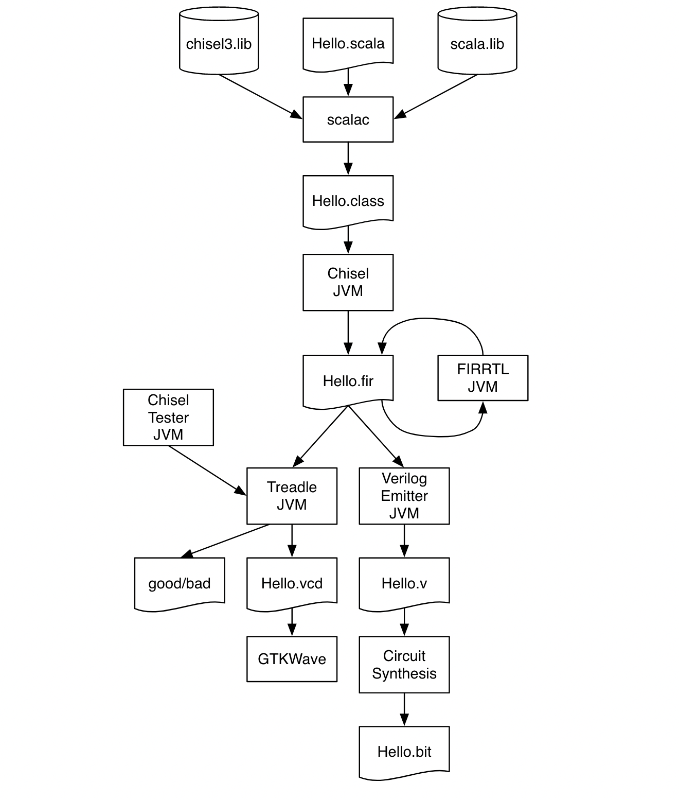
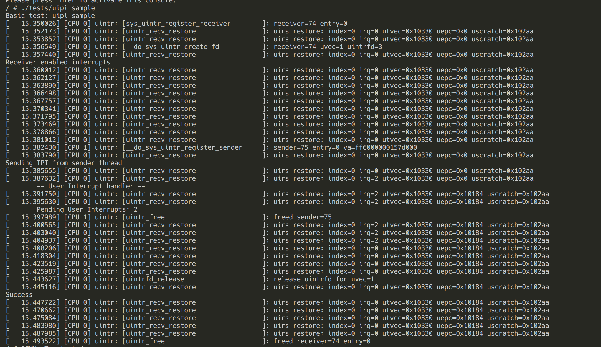

# Graduation Journal

## 6.1

修复时钟后，测得性能数据如下：

|            | 10000     | 20000     | 30000     | 40000     | 50000      | 60000      | 70000      | 80000      | 90000      | 100000     |
| ---------- | --------- | --------- | --------- | --------- | ---------- | ---------- | ---------- | ---------- | ---------- | ---------- |
| uintrfd-bi | 112.574   | 222.591   | 345.375   | 444.472   | 556.355    | 681.272    | 792.516    | 887.026    | 1009.546   | 1123.372   |
| eventfd-bi | 14907.945 | 31157.320 | 47482.456 | 61318.600 | 72830.175  | 103307.301 | 118841.208 | 139140.156 | 135107.971 | 141305.496 |
| signal     | 21259.877 | 46230.731 | 66210.982 | 85185.331 | 113183.974 | 135369.508 | 163863.470 | 173546.772 | 207079.091 | 226460.674 |
| pipe       | 18897.906 | 37463.461 | 56473.265 | 75078.817 | 94003.287  | 112901.001 | 131516.832 | 151140.548 | 169202.044 | 187497.428 |

添加更多 thread 竞争 CPU：

|                          | 0       | 1       | 2       | 3        |
| ------------------------ | ------- | ------- | ------- | -------- |
| uintrfd-bi (10000 times) | 119.859 | 298.213 | 525.235 | 1226.173 |

## 5.25

uipi.send 相关数据统计：

send -> trap: 100 cycles

trap -> handler: 400 cycles

ch1 相关工作、ch2 本章小结、ch3 增加问题分析、ch5 测试程序移到 ch4 

now() 函数占了大部分时间，移除单次通信的时间后：

**Total Duration (ms)**

|            | 1        | 10       | 20       | 50        | 100       | 200       | 500       |
| ---------- | -------- | -------- | -------- | --------- | --------- | --------- | --------- |
| uintrfd-bi | 55.512   | 491.816  | 631.244  | 811.728   | 1472.214  |           |           |
| eventfd-bi | 571.922  | 1651.836 | 2635.774 | 4845.242  | 9755.916  | 17136.314 | 46036.144 |
| signal     | 232.070  | 2667.824 | 4423.518 | 9415.078  | 20575.994 | 35172.434 | 90251.908 |
| pipe       | 1028.134 | 2535.718 | 4912.010 | 10612.178 | 19702.906 | 40028.224 | 97839.664 |

## 5.20

数据记录：

**Total Duration (ms)**

|            | 1       | 10       | 20       | 50        | 100       | 200       | 500       |
| ---------- | ------- | -------- | -------- | --------- | --------- | --------- | --------- |
| uintrfd-bi | 636.356 | 788.028  | 1112.460 | 2363.738  | 4900.320  | 9164.130  | .         |
| eventfd-bi | 672.012 | 1351.258 | 2140.152 | 5732.096  | 8983.268  | 19560.802 | 48408.076 |
| signal     | 272.338 | 1352.936 | 4111.228 | 9191.826  | 19151.840 | 35710.320 | 94247.590 |
| pipe       | 672.514 | 2907.524 | 4576.514 | 10911.936 | 19387.776 | 40088.440 | 97851.648 |


## 5.17

构建 Rocket Chip 并成功运行 OpenSBI：

遇到的问题：

- 到底该如何 reset ，最简单的办法是让 ps 端通过 AXI 控制 sys_reset 这个信号，目前的做法是在 pl 中配置了一个 AXI_GPIO ，设备树节点由 SDK 中的 hsi 自动生成，ps 端的 Linux 看到这个设备后会在 /sys/class/gpio 中创建对应的文件，只需要利用操作 gpio 的办法就可以 reset Rocket Chip 。
- 之前读写内存失败可能是地址没有配置正确，ps 端看到的 reserved-memory 虽然在总线上地址是从 0x8_0000_0000 开始的，但是在 mmap 读写这块区域时，传入的地址实际上是偏移量； SoC 搭建时配置的地址映射应该是一样的，因为 S_AXI_HP0_FPD 直接连接在 DDR 控制器上。
- 在 reset 时应该重新加载 OpenSBI ，因为 OpenSBI 在 .data 段有 lotery 等变量，在启动初始化时默认这些变量是 0 。
- 采用 pl 的串口到 ps 的串口的办法，看不到输出，学长建议直接将 pl 的串口绑定引脚，成功在串口终端看到连续的乱码，说明 Rocket Chip 正常运行 OpenSBI ，串口的波特率配置存在问题。
- 在台式机上连接串口时，需要指定波特率为 57600 才能看到正确的输出，原因不详，可能是 OpenSBI 算错了，也可能是主机的驱动算错了。

项目结构更新：

- `common`：和 uintr 相关的 scala 代码，以及一些公共的构建脚本，参考自 zynq-fpga 等项目：
  - `Makefrag`：公共的构建脚本，会被开发版文件夹引用；
  - `build.sh`：参考自 rocket-tools ，用于编译和安装 tests 和 spike，因为这两个子模块可能有我们自己的改动；
  - `boot`：和 boot 有关的代码、工具
- `digilent-vivado-scripts`：维护 vivado 项目，checkin 从 xpr 生成 tcl 脚本，checkout 从 tcl 生成 xpr 项目文件
- `rocket-chip`：作为子模块指向 v1.6 版本的 rocket-chip 项目，这是 fork 后绑定的版本；
- `spike`：作为子模块指向最新版的 riscv-isa-sim 项目；指令级别的模拟器，暂时不会修改这个模拟器，因为可以跑裸汇编并查看波形确保正确性，且硬件设计的规模不是很大；
- `tests`：作为子模块指向最新版的 riscv-tests 项目，主要在这个项目中添加 uintr 的汇编测例；
- `zcu102`：zcu102 开发板相关配置，包括引脚绑定、时钟配置、block design 项目生成脚本等；
  - `dts`：rocket chip 上运行 OpenSBI 和 Linux 使用的设备树，ps 端运行 Linux 使用的设备树
  - `proj`：vivado 项目目录
  - `src`：资源文件目录
    - `bd`：项目的 tcl 文件
    - `hdl`：主要是 rocket chip 文件和顶层的 wrapper
    - `constraints`：硬件约束，用来绑定引脚

## 4.31

构建在 FPGA 的 Block Design 上连接的 Top Module 。

参考以下几个项目：

- [rc-fpga-zcu](https://github.com/li3tuo4/rc-fpga-zcu)：一个参考 fpga-zynq 项目在 zcu102 上搭建 Rocket Chip 运行 Linux，优点是分离了自己添加的代码和 Rocket Chip 项目本来的代码，缺点是太久没有更新了，而且 Adapter 的功能并不是必需的。
- [labeled-RISC-V](https://github.com/LvNA-system/labeled-RISC-V)：优点是 SoC 搭建比较完整，缺点是自己的代码和 Rocket Chip 混合在一起，也是太久没有更新了。
- [rocket-chip-vcu128](https://github.com/jiegec/rocket-chip-vcu128)：优点是跟踪了最新版本的 Rocket Chip，项目构建非常清晰，问题是板子不太一样。

现在 Top Module 对外暴露了 MEM 和 MMIO 的 AXI 端口，以及外部的 reset 信号和中断信号，可以在 PS 端或使用 Jtag （目前还没有连接） 对 Rocket Chip 进行复位，非常方便。

## 4.30

CS250 中对 RoCC 指令的[介绍](https://inst.eecs.berkeley.edu/~cs250/fa13/handouts/lab3-sumaccel.pdf)，指令中 xd, xs1, xs2 位是寄存器的控制位，如果 xs1 为 0 就代表不从 rs1 中读内容，xd 为 0 就代表不写入到 rd 中，因此 UIPI READ 指令 14-12 位需要改为 0b110 。

查看 HellaCacheArbiter 的波形，注意到 requestor_1 是 RoCC 的请求，`io.mem.s2_nack` 被拉高，根据注释中的说法，说明写请求失败了，继续查找相关逻辑，注意到 `io.cpu.s2_nack` 这个信号为 0 的原因是 `s2_dont_nack_uncached` 为 0，也就是 `s2_valid_uncached_pending` 为 0,也就是 `uncachedInFlight` 为 1：

```scala
// DCache.scala
val s2_valid_uncached_pending = s2_valid_miss && s2_uncached && !uncachedInFlight.asUInt.andR
val s2_dont_nack_uncached = s2_valid_uncached_pending && tl_out_a.ready
```

DCache 的逻辑非常复杂，s2_nack 和 ready 一直为 0 是有关联的吗？

目前可以确定 MEM read/write 和 UINTC 的 read 都会正常收到 resp，但是 UINTC 的 write 不会收到 resp 。流水线中有对 DCache write 的处理，所以 UIPI 协处理器也需要对写操作进行一些处理。观察到 DCache 在直接通过 sd 写 UINTC 时，也拉高了 s2_nack 这个信号并进行了 replay ，且 resp.valid 一直为 0 ，流水线中的 pc 也发生了回退，说明流水线确实对 s2_nack 进行了处理。

DCache 有三个端口：CPU 的 dmem，RoCC IF 的 cache，以及 PTW 的 mem ，三者会经过仲裁向 DCache 发请求。 RoCC 连一个 IF 的目的是作为多个 RoCC 的缓冲，然而当 MMIO 请求不返回 resp.valid 时， SimpleHellaCacheIFReplayQueue 阻塞，从 RoCC 的视角来看 ready 就永远是 0。

**解决办法**：

1. 在协处理器里手动将记录 DCache 响应后的 cycle，然后根据 s2_nack 决定是否要重新发起请求。
2. 由于目前只有 RoCC，可以直接移除 SimpleHellaCacheIF ，直接将 DCacheArbiter 和协处理器相连。 

### 目前 RISC-V 用户态中断扩展的功能已全部实现：

- RISC-V N 扩展（U 态 CSR 和中断处理）
- UINTC 用户态中断控制器
- UIPI 协处理器（基于 RoCC）

## 4.26

### 学习 seL4

对于 seL4 IPC 的概括：**IPC is the seL4 mechanism for implementing cross-domain function calls.** seL4 中的 IPC 可以理解为函数调用，不能跨核，不支持大块数据传输（**for RPC-like invocation of functions in a different address space.**）多核场景下，应该使用 Notification 机制，主要关注 `seL4_Signal` 等函数。

### UIPI

关于发送方状态的处理，想到以下几种方案：

1. 目前的设计方案是发送方的 UIPI_SEND 指令会向内存发送一次读请求，向外设发送一次写请求，且读请求需要先读到 `CSR.suist`，也就是说需要在 WB 阶段进行处理（否则需要前传），这里的读写请求都是 uncached 。在指令 WB 阶段连接协处理器（或者可以直接在 CSR.scala 里面处理）。读内存的请求可以连接到 DCache 上，所有的 UIPI 指令都需要在 WB 阶段读写 UINTC 外设，因此需要添加新的 Node 。

2. 发送方状态也放在 UINTC 中维护，需要使用 Block RAM ，UINTC 可以维护的连接数量是有限的（受限于 BRAM 宽度），因此要么只允许这个数量的连接（register_sender 系统调用返回 ENOSPC 之类的错误码，发送方只能手动 unregister），要么将 UINTC 中的状态表组织成全相联结构，作为内存中完整的表的一个子集（Cache），用户在发送前，需要将将要使用的 index 进行 preload 操作，也就是告诉内核在 UINTC 中装填对应的 index ，原来的项需要被替换到内存中，这样就不需要指令完成读内存操作了。系统调用扩充为类似于 `sys_register_sender(fd, load_mask)`，其中 `load_mask` 是用户想在接下来使用的槽位，该系统调用仍返回 index，需要用户自己维护已分配的 mask 。如果发送方没有进行 preload，可能会导致发送失败。

3. 发送方的状态在每次调度的时候写入到 UINTC 中，UINTC 只需要维护 hart 数量乘以接收方数量这么多的状态即可。

4. UINTC 访问内存，读取发送方状态

### 接收方数量超出 UINTC 容量的解决办法

UINTC 只维护正在运行的接收方的状态，作为全部接收方状态的子集；

UIPI SEND 发送给不在运行的接收方会触发 Store Fault ，最好能在 MEM 阶段完成外设的访问，所以考虑采用上述方案 4；

内核负责写入到不在运行的接收方的 pending 位。

## 4.24-4.25

参考 CLINT 和 PLIC 实现 UINTC 外设：

首先定义 device 并指定名称和 compatible，和 QEMU 中生成设备树的逻辑类似，在这里需要指定 UINTC 连接到 intc ，且需要指定为 interrupt-controller 让 linux 完成初始化（interrupt-controller 实际上是接收中断的控制器）。

```scala
val device = new SimpleDevice("uintc", Seq("riscv,uintc0")) {
  override val alwaysExtended: Boolean = true

  override def describe(resources: ResourceBindings): Description = {
    val Description(name, mapping) = super.describe(resources)
    val extra = Map("interrupt-controller" -> Nil, "#interrupt-cells" -> Seq(ResourceInt(1)))
    Description(name, mapping ++ extra)
  }
}
```

定义 node 来配置 UINTC 寄存器的读写端口：

```scala
val node: TLRegisterNode = TLRegisterNode(
  address = Seq(params.address),
  device = device,
  beatBytes = beatBytes,
  concurrency = 1) // limiting concurrency handles RAW hazards on claim registers
```

定义 intnode 来实现 `uintc -> intc -> usip` 的连接，在写入操作里将 ipi 寄存器对应位置位，这里应该是一个很大的比较逻辑：

```scala
val intnode: IntNexusNode = IntNexusNode(
  sourceFn = { _ => IntSourcePortParameters(Seq(IntSourceParameters(1, Seq(Resource(device, "int"))))) },
  sinkFn = { _ => IntSinkPortParameters(Seq(IntSinkParameters())) },
  outputRequiresInput = false)

// pending 未被清空时，拉高 ipi，这里是一个比较大的组合逻辑，相当于长度为 512 的按位或
// 时序紧张时或许可以考虑改成二分的按位或？ Chisel 应该有相关函数
val ipi = Seq.fill(nHarts) { RegInit(0.U) }
ipi.zipWithIndex.foreach { case (hart, i) =>
  hart := uirs.map(x => x.pending =/= 0.U && x.active && hartId(x.hartid) === i.asUInt).reduce(_ || _)
}
val (intnode_out, _) = intnode.out.unzip
intnode_out.zipWithIndex.foreach { case (int, i) =>
  int(0) := ShiftRegister(ipi(i), params.intStages) // usip
}

// 基址 -> Seq[RegField(nBits, RegReadFn, RegWriteFn)]
sendOffset(i) -> Seq(RegField(64, (),
  RegWriteFn { (valid, data) =>
    x.pending := x.pending | (valid << data(5, 0)).asUInt
    Bool(true)
  }))
```

最后定义一系列的 RegField 实现所有 uirs 的读写操作，调用 `node.regmap(opRegFields)` 进行注册。

关键的是需要将中断信号连接到对应核的 usip ，参考 mtip，msip 等寄存器的设置，连接  core.interrupts 和 intSinkNode ：

```scala
// freechips.rocketchip.subsystem.CanAttachTile
// From UINTC: "usip" (only if user mode is enabled)
if (domain.tile.tileParams.core.useUser) {
  domain.crossIntIn(crossingParams.crossingType) :=
    context.uintcOpt.map { _.intnode }
      .getOrElse { NullIntSource() }
}

// freechips.rocketchip.tile.SinksExternalInterrupts
// debug, msip, mtip, meip, seip, usip, lip offsets in CSRs
def csrIntMap: List[Int] = {
  // ...
  val usip = if (usingUser) Seq(0) else Nil
  List(65535, 3, 7, 11) ++ seip ++ usip ++ List.tabulate(nlips)(_ + 16)
}

// go from flat diplomatic Interrupts to bundled TileInterrupts
def decodeCoreInterrupts(core: TileInterrupts): Unit = {
  // ...
  val usip = if (core.usip.isDefined) Seq(core.usip.get) else Nil
  // ...
  val (interrupts, _) = intSinkNode.in(0)
  (async_ips ++ periph_ips ++ seip ++ usip ++ core_ips).zip(interrupts).foreach { case(c, i) => c := i }
}
```

最后在 CSR 内读到连接后的 io.interrupts 并触发 CPU 的中断：

```scala
// usip is the OR of reg_mip.usip and the actual line from the UINTC
io.interrupts.usip.foreach { mip.usip := reg_mip.usip || _ }
val pending_interrupts = high_interrupts | (read_mip & reg_mie)
val u_interrupts = Mux(nmie && reg_mstatus.prv === PRV.U && reg_mstatus.uie, pending_interrupts & read_sideleg, UInt(0))
```

IDEA 报错找不到 symbol ，解决办法是 `File->Invalidate Caches` 再重启。

仿真环境下从 send 写指令发出到触发中断，大概需要 **10~ cycles** 。

修改代码后最好能 make clean 并删除 rocketchip.jar，不然可能出现跳过新改动的情况。

## 4.21

添加 uipi 测例，首先对 suicfg，suirs，suist 寄存器进行读写，对 UINTC 外设进行读写来完成初始化配置；

主线程同时作为发送方和接收方，发送用户态中断后，进入处理函数后会将全局的 result 写为 0xdead ，同时在主线程轮询 result 直到 result 变为 0xdead。

```asm
  # suicfg
  li t0, UINTC_BASE
  csrw 0x1b2, t0
  TEST_CASE(0, t1, UINTC_BASE, csrr t1, 0x1b2)
  
  # suirs: v=1, idx=0
  li t0, (1 << 63)
  csrw 0x1b1, t0
  TEST_CASE(1, t1, 0, csrr t1, 0x1b1; xor t1, t1, t0)
  # mode=1, hartid=a0, pendings=0
  slli t0, a0, 16
  ori t0, t0, 2
  li t1, UITNC_LOW(0)
  sd t0, 0(t1)
  li t1, UINTC_HIGH(0)
  sd zero, 0(t1) 

  # suist: v=1, uvec=3, uirs_idx=0
  la t0, uiste
  li t1, ((3 << 16) | 1)
  sd t1, 0(t0)
  srli t0, t0, 12
  li t1, ((1 << 63) | (1 << 44))
  or t0, t0, t1
  csrw 0x1b0, t0
  TEST_CASE(2, t1, 0, csrr t1, 0x1b0; xor t1, t1, t0)

  # jump to user land
  li t0, SSTATUS_SPP
  csrc sstatus, t0
  la t0, 1f
  csrw sepc, t0
  csrsi sideleg, MIP_USIP
  sret
  1:

finish:
  # setup user interrupt handler
  la t0, utvec_handler
  csrw utvec, t0

  # enable user interrupt
  csrsi ustatus, USTATUS_UIE
  csrsi uie, MIP_USIP

  # activate
  .insn i 0b1111011, 0b010, x0, x0, 0x3

  # send interrupt
  li t0, 0
  .insn i 0b1111011, 0b010, x0, t0, 0x0

wait:
  li t0, 0xdead
  lw t1, result
  bne t0, t1, wait

  RVTEST_PASS

  # We should only fall through to this if scall failed.
  TEST_PASSFAIL
```

## 4.18-4.19

在 rocket chip 加入了用户态中断需要的 CSR 寄存器并通过测例；整体改动和 QEMU 类似；

在改动的过程中，遇到很多和 HS，VS 有关的代码，暂时没有考虑逻辑相互影响可能产生的问题；

### csrrw

参考已有的读写 CSR 代码：

```scala
if (usingUser && usingUintr) {
  val read_uie = reg_mie & read_sideleg
  val read_uip = read_mip & read_sideleg
  val read_ustatus = Wire(init = 0.U.asTypeOf(new MStatus))
  read_ustatus.upie := io.status.upie
  read_ustatus.uie := io.status.uie
  val uintr_csrs = LinkedHashMap[Int, Bits](
    CSRs.ustatus -> (read_ustatus.asUInt())(xLen-1,0),
    CSRs.uie -> read_uie.asUInt,
    CSRs.uip -> read_uip.asUInt,
    CSRs.ucause -> reg_ucause,
    CSRs.uepc -> reg_uepc,
    CSRs.utval -> reg_utval,
    CSRs.utvec -> reg_utvec,
    CSRs.uscratch -> reg_uscratch)
  read_mapping ++= uintr_csrs

  read_mapping += CSRs.sideleg -> read_sideleg

  read_mapping += CSRs.suirs -> reg_suirs.asUInt
  read_mapping += CSRs.suist -> reg_suist.asUInt
  read_mapping += CSRs.suicfg -> reg_suicfg
}

if (usingUser && usingUintr) {
  when (decoded_addr(CSRs.ustatus)) {
    val new_ustatus = new MStatus().fromBits(wdata)
    reg_mstatus.uie := new_ustatus.uie
    reg_mstatus.upie := new_ustatus.upie
  }
  when (decoded_addr(CSRs.uip)) {
    val new_uip = new MIP().fromBits((read_mip & ~read_sideleg) | (wdata & read_sideleg))
    reg_mip.usip := new_uip.usip
  }
  when (decoded_addr(CSRs.uie)) { reg_mie := (reg_mie & ~read_sideleg) | (wdata & read_sideleg) }
  when (decoded_addr(CSRs.uscratch)) { reg_uscratch := wdata }
  when (decoded_addr(CSRs.uepc)) { reg_uepc := wdata }
  when (decoded_addr(CSRs.utvec)) { reg_utvec := wdata }
  when (decoded_addr(CSRs.utval)) { reg_utval := wdata }
  when (decoded_addr(CSRs.ucause)) { reg_ucause := wdata & scause_mask }

  when (decoded_addr(CSRs.sideleg)) { reg_sideleg := wdata }

  when (decoded_addr(CSRs.suirs)) {
    val new_suirs = new SUIRS().fromBits(wdata)
    reg_suirs := new_suirs
  }
  when (decoded_addr(CSRs.suist)) {
    val new_suist = new SUIST().fromBits(wdata)
    reg_suist := new_suist
  }
  when (decoded_addr(CSRs.suicfg)) { reg_suicfg := wdata }
}
```

### trap

注意到如下代码：

```scala
val read_mtvec = formTVec(reg_mtvec).padTo(xLen)
val read_stvec = formTVec(reg_stvec).sextTo(xLen)

def formTVec(x: UInt) = x andNot Mux(x(0), ((((BigInt(1) << mtvecInterruptAlign) - 1) << mtvecBaseAlign) | 2).U, 2)
```

为什么 stvec 要采用符号扩展？

添加对委托中断的处理和跳转：

```scala
val delegateU = Bool(usingUser && usingUintr) && reg_mstatus.prv === PRV.U && delegate && read_sideleg(cause_lsbs)
// ...
val base = Mux(delegate, Mux(delegateVS, read_vstvec, Mux(delegateU, read_utvec, read_stvec)), read_mtvec)
```

修改 S 态中断的逻辑，需要屏蔽已经委托给 U 态的中断；

```scala
val s_interrupts = Mux(nmie && (reg_mstatus.v || reg_mstatus.prv < PRV.S || (reg_mstatus.prv === PRV.S && reg_mstatus.sie)), pending_interrupts & read_mideleg & ~read_hideleg & ~read_sideleg, UInt(0))
val u_interrupts = Mux(nmie && reg_mstatus.prv === PRV.U && reg_mstatus.uie, pending_interrupts & read_sideleg, UInt(0))
val (anyInterrupt, whichInterrupt) = chooseInterrupt(Seq(u_interrupts, vs_interrupts, s_interrupts, m_interrupts, nmi_interrupts, d_interrupts))
```

### uret

位于 `rocket/CSR.scala` 中的修改：

`decode_table` 用来区分特权指令的功能，使用 List 来设置 `insn_call` 、`insn_break` 、`insn_ret` 等，注意到 `insn_ret` 包括以下几种指令：

```scala
def MRET = BitPat("b00110000001000000000000001110011")
def SRET = BitPat("b00010000001000000000000001110011")
def URET = BitPat("b00000000001000000000000001110011")
def DRET = BitPat("b01111011001000000000000001110011")
def MNRET = BitPat("b01110000001000000000000001110011")
```

根据 `io.rw.addr` 来判断当前 `insn_ret` 指令具体是哪个，对应 uret 第八位和第九位都是 0 ，添加如下分支实现 uret 的硬件逻辑。

```scala
when (Bool(usingUser && usingUIntr) && !io.rw.addr(9) && !io.rw.addr(8)) {
  reg_mstatus.uie := reg_mstatus.upie
  reg_mstatus.upie := true
  ret_prv := PRV.U
  io.evec := readEPC(reg_uepc)
}
```

在 `rocket/RocketCore.scala` 中添加指令解码：

```scala
val decode_table = {
  // ...
  (usingUser.option(new UDecode)) ++:
  // ...
} flatMap(_.table)
```

定义位于 `rocket/IDecode.scala`：

```scala
// 各项含义
def default: List[BitPat] =
              //           jal                                                             renf1               fence.i
              //   val     | jalr                                                          | renf2             |
              //   | fp_val| | renx2                                                       | | renf3           |
              //   | | rocc| | | renx1       s_alu1                          mem_val       | | | wfd           |
              //   | | | br| | | |   s_alu2  |       imm    dw     alu       | mem_cmd     | | | | mul         |
              //   | | | | | | | |   |       |       |      |      |         | |           | | | | | div       | fence
              //   | | | | | | | |   |       |       |      |      |         | |           | | | | | | wxd     | | amo
              //   | | | | | | | | scie      |       |      |      |         | |           | | | | | | |       | | | dp
              List(N,X,X,X,X,X,X,X,X,A2_X,   A1_X,   IMM_X, DW_X,  FN_X,     N,M_X,        X,X,X,X,X,X,X,CSR.X,X,X,X,X)
class UDecode(implicit val p: Parameters) extends DecodeConstants
{
  val table: Array[(BitPat, List[BitPat])] = Array(
    URET -> List(Y, N, N, N, N, N, N, X, N, A2_X, A1_X, IMM_X, DW_X, FN_X, N, M_X, N, N, N, N, N, N, N, CSR.I, N, N, N, N))
}
```

## 4.16-4.17

用了大概一天半的时间，修复了运行 uintrfd 测例的存在的问题：

- 单核下运行，用户态注册的 fd 和系统调用传给内核的 fd 不一致：单核下 Server 向 Client 发送的中断就是发给同一个核，由于没有在切换时清空原来的线程对应 UINTC 中的 Active 位，导致 Server 发送的中断触发了自己的处理函数，然后在处理函数中得到的 pending bits 为 0，进而根据测例的逻辑对全局 fd 进行了错误的修改；
- 多核下运行，会随机出现卡住，报错等各种问题，目前原因未知。

修复 QEMU 中比较明显的 Bug，具体见 commit 信息；在 Linux 陷入的入口直接执行 UIPI_DEACTIVATE 因为此时 suirs 还没有发生改变。

Linux 中存在一个比较隐匿的 Bug，最开始我为了方便起见，将 riscv_uintr_restore 放在了 resume_userspace 中执行，然而通过观察日志发现，进行让权的线程在返回时会调用这个函数，导致 Active 位再次被写为 1，因此需要将外设的状态分开处理，目前采用的办法是在 restore_all 的时候才执行 UIPI_ACTIVATE，因为此时 suirs 一定是接下来运行的线程的状态。

解决上述问题后，在 QEMU 上运行的性能相比 signal 性能提升了 25 倍左右。

## 4.15

编译运行 emulator 报错 `/usr/bin/env: ‘python’: No such file or directory`，安装 `python-is-python3` 可以解决。

## 4.14

先确保可以正常编译和仿真后搭建项目开发环境：使用 IDEA 作为 rocket chip 的编辑器，目前可以很好地支持代码跳转、代码补全等功能；
打开 IDEA 后选择从已存在的源代码中创建工程，选择代码根目录下的 build.sbt 文件，在 Import Project 对话框中选择 Library sources、sbt sources、project reload、builds、Allow overriding sbt version，JDK 版本选择 8，Launcher 选择 Custom 并选中代码根目录下的 sbt-launch.jar。

### 截至目前的项目组织

在使用此项目前应该确保 riscv 工具链已经安装好，推荐在 Ubuntu20.04 上进行开发。

- `common`：和 uintr 相关的 scala 代码，以及一些公共的构建脚本，参考自 zynq-fpga 等项目：
  - `Makefrag`：公共的构建脚本，会被开发版文件夹引用；
  - `build.sh`：参考自 rocket-tools ，用于编译和安装 tests 和 spike，因为这两个子模块可能有我们自己的改动；
- `rocket-chip`：作为子模块指向 v1.6 版本的 rocket-chip 项目，这是 fork 后绑定的版本；
- `spike`：作为子模块指向最新版的 riscv-isa-sim 项目；指令级别的模拟器，暂时不会修改这个模拟器，因为可以跑裸汇编并查看波形确保正确性，且硬件设计的规模不是很大；
- `tests`：作为子模块指向最新版的 riscv-tests 项目，主要在这个项目中添加 uintr 的汇编测例；
- `zcu102`：zcu102 开发板相关配置，包括引脚绑定、时钟配置、block design 项目生成脚本等；

阅读 chisel 入门手册，重温了一遍硬件开发规则，方便之后阅读 Rocket Chip 源码，主要关注：

- 复杂的 FSM
- 如何使用 FPGA 上自带的 Block RAM
- 符号约定、变量约定等

### riscv-tests

在 rocket chip 中跑某个测例的仿真：`make output/rv64ui-p-add.out` 和 `make output/rv64ui-p-add.vcd`

riscv 测例主要按特权级和指令模块进行分类，U 态运行的是基本指令测试，S 态和 M 态运行的大多数是一些和 CSR 、特权指令相关的测试；前缀中带有字母 `p` 表示不开虚存，且只有 0 号核被启动，`v` 表示开虚存。

参考已有的测例，编写 N 扩展的测例，目前编译器已经支持 U 态的 CSR 和 uret ：

```asm
#include "riscv_test.h"
#include "test_macros.h"

RVTEST_RV64S
RVTEST_CODE_BEGIN

  TEST_CASE(0, a0, 3, csrwi uscratch, 3; csrr a0, uscratch);
  TEST_CASE(1, a0, 3, csrwi utvec, 3; csrr a0, utvec);
  TEST_CASE(2, a0, 3, csrwi utval, 3; csrr a0, utval);
  TEST_CASE(3, a0, 3, csrwi uepc, 3; csrr a0, uepc);
  li a1, MIP_USIP;
  TEST_CASE(4, a0, 1, csrsi uip, IRQ_U_SOFT; csrr a0, uip; and a0, a0, a1);
  TEST_CASE(5, a0, 1, csrsi uie, IRQ_U_SOFT; csrr a0, uie; and a0, a0, a1);
  TEST_CASE(6, a0, 1, csrsi sideleg, IRQ_U_SOFT; csrr a0, sideleg; and a0, a0, a1);

  # jump to user land
  li t0, SSTATUS_SPP
  csrc sstatus, t0
  la t0, 1f
  csrw sepc, t0
  # setup user interrupt handler
  csrw uepc, t0
  la t0, utvec_handler
  csrw utvec, t0
  sret
  1:
  
finish:
  TEST_CASE(7, a0, 0xdead, lw a0, result);
  RVTEST_PASS

  # We should only fall through to this if scall failed.
  TEST_PASSFAIL

.align 2
  .global utvec_handler
utvec_handler:
  li t0, 0xdead
  la t1, result
  sw t0, 0x0(t1)
  uret

RVTEST_CODE_END

  .data
RVTEST_DATA_BEGIN
  .align 3
result:
  .dword 0
RVTEST_DATA_END
```

查看 `output/rv64sn-p-csr.out`：

```log
C0:      20260 [0] pc=[00000000800001ac] W[r 0=0000000000000000][0] R[r 0=0000000000000000] R[r 0=0000000000000000] inst=[0401d073] csrwi   unknown_040, 3
```

由于 rocket chip 里面还没有实现，运行到第一个测例就抛出异常了。

## 4.10

Rocket Chip 在 emulator 中执行出现问题，报错找不到 `std::optional`。原因参见 [issue#3225](https://github.com/chipsalliance/rocket-chip/issues/3225) 。可能是 rocket-tools 版本不匹配，新版的 spike 用了 C++17 的特性，而 verilator 里面 `CFG_CXXFLAGS_STD_NEWEST` 根据 Linux 的版本设置，需要手动更改为 C++17，参见 [pull#3226](https://github.com/chipsalliance/rocket-chip/pull/3226)，这个 Commit 将 Verilator 的版本更新到了 4.226 并跟踪了新版的 spike 。

Chisel Build 和 Test 的流程：

- The digital circuit is described in a Chisel class shown as Hello.scala.
- The Scala compiler compiles this class, together with the Chisel and Scala libraries, and generates the Java class Hello.class that can be executed by a standard Java virtual machine (JVM).
- Executing this class with a Chisel driver generates the so-called flexible intermediate representation for RTL (FIRRTL), an intermediate representation of digital circuits. The FIRRTL compiler performs transformations on the circuit.
- Treadle is a FIRRTL interpreter to simulate the circuit. Together with the Chisel tester it can be used to debug and test Chisel circuits. With assertions we can provide test results. Treadle can also generate waveform files (Hello.vcd) that can be viewed with a waveform viewer (e.g., the free viewer GTKWave or Modelsim).
- One FIRRTL transformation, the Verilog emitter, generates Verilog code for synthesis (Hello.v). A circuit synthesize tool (e.g., Intel Quartus, AMD/Xilinx Vivado, or an ASIC tool) synthesizes the circuit. In an FPGA design flow, the tool generates the FPGA bitstream that is used to configure the FPGA, e.g., Hello.bit.



## 4.6

git submodule 相关指令：

- `git diff --cached --submodule`：查看子模块的更改
- `git fetch && git merge origin/master`：手动从上游分支拉取修改，合并分支
- `git submodule update --remote`：子模块自动抓取与更新
- `git config -f .gitmodules submodule.Submodule.branch stable`：子模块跟踪仓库的其他分支
- `git config status.submodulesummary`：显示子模块的更改摘要

参照 RISC-V 工具链的配置过程，新建项目 `uintr-rocket-chip`，将 rocket-chip ，spike，riscv-tests 等项目作为子模块导入。

Spike 是指令级别的仿真器，需要对 Spike 进行修改来支持 RISC-V 用户态中断。

安装 Vivado2017.1 发现貌似可以在 Ubuntu 20.04 上正常运行，输出：

```txt
ERROR: [17-356] Failed to install all user apps. 
```

执行 `vivado -mode tcl` 并在命令行输入 `tclapp::reset_tclstore` ，重启 vivado 即可。

在 `rc-fpga-zcu` 里面尝试 `make bitstream` ，出现找不到 device 的报错，原因可能是 Vivado2017.1 不支持 zcu102 ？

最后将 Vivado2017.1 升级为完整版，可以正常生成比特流，可以进入图形界面看到 block design 。

## 4.5

发现 litex 项目，可以仿真 vecriscv 并运行 Linux ，按照仓库内的提示配置环境后执行 `./sim.py` 会卡在 Linux 启动。

该项目号称支持 zcu102 ，并没有相关的演示，理想的方案是 Litex + Rocket Chip 仿真 Linux 后直接在 zcu102 上完成测试。

Rocket Chip 目前可以在搭建好的 docker 容器进行仿真，对 riscv-tests 进行分析并编写指令测例（UIPI 指令和读写外设）

## 4.4

先安装 [rocket-tools](https://github.com/chipsalliance/rocket-tools)，由于之前已经安装过 riscv-gnu-toolchain ，只能参考脚本手动安装仓库包含的项目：

- [x] riscv-isa-sim：Spike 模拟器
- [x] riscv-tests：RISC-V 处理器的单元测试
- [x] riscv-openocd：硬件调试，目前对这方面不太了解
- [x] riscv-pk：Proxy Kernel，pk 可以执行静态 ELF，提供 bbl 用来引导 RISC-V Linux
- [x] riscv-gnu-toolchain：RISC-V 工具链，需要 riscv-unknown-elf 和 riscv-unknown-linux-gnu

工具链的 submodule 拉取太慢，把里面的部分 url 改成 tuna 镜像源。

最后执行 `tar -zcvf rocket-tools.tar.gz riscv-gnu-toolchain riscv-isa-sim riscv-openocd riscv-pk riscv-tests build.sh` 这样就不需要每次都 clone 了。

勉强安装成功后，Rocket Chip 切到 v1.6 也就是最新的 release 版本， emulator 里尝试 make，报错找不到头文件，查看相关 [issue](https://github.com/chipsalliance/rocket-chip/issues/2766) 发现是 bison 版本过高导致的，然而我的电脑是 Ubuntu 22.04 版本，默认安装的 bison 就是 3.8.2，只能想其他办法。

学习 Docker 构建和开发流程，编写 Dockerfile ，由于仓库拉取比较麻烦，选择先在 clone 到本地，然后在 Dockerfile 中全都 COPY 进去构建，构建脚本 build.sh 来自 rocket-tools 这个官方仓库：

```docker
FROM ubuntu:20.04

# Set tzdata noninteractive
ENV DEBIAN_FRONTEND=noninteractive

# Install packages
RUN apt-get update \
    && apt-get install -y git vim wget fish autoconf automake \
    autotools-dev curl libmpc-dev libmpfr-dev \
    libgmp-dev libusb-1.0-0-dev gawk build-essential \
    bison flex texinfo gperf libtool patchutils bc \
    zlib1g-dev device-tree-compiler pkg-config \
    libexpat-dev libfl-dev gnutls-bin \
    openjdk-8-jre openjdk-8-jdk

# RISC-V tools
ENV RISCV=/root/riscv

ENV PATH=$PATH:$RISCV/bin

WORKDIR /root

# Build default tools (pre-cloned and copied from local working directory)
ADD rocket-tools.tar.gz tools
RUN cd tools && chmod +x build.sh && ./build.sh \
    && cd riscv-gnu-toolchain/build \
    && make linux -j $(nproc) \
    && make install

# Clean repos
RUN rm -rf tools

# Install sbt
RUN curl -fL https://github.com/coursier/coursier/releases/latest/download/cs-x86_64-pc-linux.gz \
    | gzip -d > cs && chmod +x cs && ./cs setup -y
```

执行 `docker build -t rocket -f Dockerfile --progress=plain . 2>&1 | tee build.log` 构建镜像，用时一个下午构建成功。执行 `docker image ls -a` 查看当前镜像，需要将该镜像 push 到 Docker Hub。执行 `docker login && docker tag rocket tkf2023/images:v1 && docker push tkf2023/images:v1` 成功将镜像上传至仓库。

Docker 清理：

- ‵docker system prune --volumes`
- `docke` container prune`：删除状态为 exited 的容器
- `docker rm -f $(docker ps -aq)`：删除所有容器
- `docker image ls -f dangling=true`：列出所有镜像（包含中间层、被容器使用的镜像）
- `docker image rm $(docker image ls -f dangling=true)`：删除所有镜像

## 3.31

- 在 Linux 上成功运行 uipi_sample，Linux 实现初步完成



- 小结：QEMU -> tCore (libc) -> Linux 开发路线优化掉了很多未知的问题

## 3.30

- [修复上周遇到的 bug](https://github.com/tkf2019/tCore/commit/44861906cceb0a0ce0027792d63a8bd3f2ffb670)，原因：
  - 用户中断处理函数修改的变量需要加 `volatile` 防止被优化；
  - 需要保存 upec 因为 task 可能在不同核上运行；
- [Linux 内核开发日志](./linux-journal.md)

## 3.19

在用户态进行测试，测例与 x86 linux 中给出的 uipi_sample 基本一致：

- 测例地址：[uipi_sample.c](https://github.com/tkf2019/tCore-test/blob/main/libc/src/uintr/uipi_sample.c)
- lib 库封装：[uintr.h](https://github.com/tkf2019/tCore-test/blob/main/libc/src/uintr/uintr.h)，[uintr.S](https://github.com/tkf2019/tCore-test/blob/main/libc/src/uintr/uintr.S)
- 内核实现：[kernel/arch/riscv64/uintr.rs](https://github.com/tkf2019/tCore/blob/main/kernel/src/arch/riscv64/uintr.rs)
- 开发日志：[kernel-journal](./kernel-journal.md)

## 3.16

本周在继续完善 tCore，修复一系列 Bug，目前支持系统调用见 [syscall/mod.rs](https://github.com/tkf2019/tCore/blob/main/kernel/src/syscall/mod.rs#L17)。

确保了 os 能正常工作，方便接下来加入新特性后的调试。

## 3.9

- 重构 tCore ，目前还在完善 syscall ，准备接下来加入 RISC-V 用户态中断的 syscall 支持
- 最近一直在阅读 Understanding the Linux Kernel ，对比 Linux 2.6.11 版本（代码干净，相比最新版本更容易理解），对于现在 tCore 内完善 syscall 支持很有帮助

## 2.19

完成 QEMU 对 RISC-V User-interrupt 的支持，在 tCore 中添加了简单的功能测试。

## 1.18

和向老师，尤学长讨论新版 RISC-V 用户态中断设计：

1. 梳理发送方，接收方处理流程。接收方不在线由内核写入 `uip` ，执行 `sret` 返回用户态后，用户态会直接跳转到 `utvec` 中断处理函数。因此 `WAKEUP` 操作可以省略。
2. 用户态中断作为一种通知唤醒机制，每次中断的发送和接收只包含 1 比特中断优先级信息。额外传递的信息由软件自行协商，例如共享内存（SQ 和 CQ）的方式。
3. 发送方获得反馈也可以通过接收方发送用户态中断的方式，因此 `TEST` 操作可以省略，这一部分交给软件自行协商处理。
4. 引入对 RV32 的支持，UINTC 添加一个 Mode 字段来区分。

## 1.14

和向老师讨论新版的 RISC-V 用户态中断设计，总结出如下几点：

1. 可以把 UIPI 指令的功能放到 ecall 中吗？准备好参数，执行 ecall 时，CPU 就发送用户态的中断请求，只是加一个系统调用号。ecall和UIPI是统一的。
2. 注册和注销就是由内核软件管理的；
3. 接收方可以不需要使用uipi指令来读用户态中断请求，而是直接访问寄存器；中断控制器只需要维护处于运行状态的进程的信息；

关于 1 ，ecall 在 CPU 中的处理流程为取指令，译码，触发 Environment call from X-mode ，X 可以是 M，S，U 三个中的任何一个，异常会在指令 commit 阶段进行处理。如果将 ecall 向 UIPI 方向扩展，就会引入：向 sysbus 发起读写请求，写回寄存器堆，有选择地不触发异常等。这无疑让 ecall 本身变得臃肿不堪，且不太适合这条指令本来的含义。现阶段 UIPI 指令的设计方式，我从 XPC Engine，蜂鸟 E203 获得了一些灵感，打算做成一块协处理器，里面加入这条指令的一系列处理和优化。

关于 3 ，为什么要把一部分放在内存里，一部分放在外设里？

注意到 intel 一条 senduipi 指令会在硬件中做这样几个事：拿 index 查 sender 的 UITT，拿 UITT 中的 UPIDADDR 读内存，处理之后再把 UPID 写回到内存，最后通过 APIC 发中断，这样总共就经过了三次访存，显然不太适合在精简指令集中采用，且硬件设计出来会非常复杂（多流水段状态维护，清空错误路径上的写请求）。

我参考了 ACLINT 等外设的设计思想，尽可能遵循以下原则引入外设 UINTC，简化操作码空间，目前每个接收方状态占用 64 B，也就是读写个 8 个操作码，从而尽可能少占用地址空间，在有限的外设地址空间内增加支持的接收方数量，目前总数为 256 ，范围为 0x4000 。

如果将所有内容放入 UINTC，也就是同时维护发送方和接收方的状态，发送方就没办法向同一个核上不同的接收方发送消息，需要发送方状态同时维护目标 hart 和接收方的 ID 。综合考虑下来，128 个核的情况下每个核需要占用 1KB 的地址空间维护信息，且内核需要同时保证这些信息的换入换出，增加了硬件的空间开销以及软件的设计复杂度。

所以采用折中的办法，类似地址翻译的查表过程放在内存中，其他部分放在 UINTC 中。

## 1.5

- 对 QEMU 进行代码分析，完善设计思路，更新 ppt
- **OS classroom**: 
  - 完成了一部分信号机制的代码，主要位于模块 tsignal 中，参考了 maturin 和 Linux 内核实现
  - 加入了 uintr 模块对 qemu 加入的指令进行测试

## 12.29

- 了解 QEMU aclint 工作原理，见 [qemu-journal](./qemu-journal.md)
- 写 RISC-V uintr specification，见 [spec](./spec.md)
- 下周计划：整理当前工作，完善 ppt 并准备开题报告

## 12.15

- 阅读 QEMU 源码：
  - 复现 xcd 的工作
  - 之前 hkp 学长已经有 RISC-N 在 QEMU 5 上的实现了，参考仓库中的 commit ，将改动移到了 QEMU 7 上
- **OS classroom**
  - 添加更多系统调用，重点完善 `sys_mmap`，`sys_munmap` 和 `sys_brk` 。`sys_mmap` 参考了 `maturin`，目前还没有处理 `MAP_SHARED` 和 `MAP_PRIVATE`；`sys_munmap` 和 `sys_brk` 参考了 Linux 内核实现。
  - 随机调换测例顺序或者测例数量，出现如下现象中的任意一种：
    - 卡在用户态的某个循环里
    - 用户态 exit code 是一个奇怪的值
    - 用户态访问非法地址
  - 和 bhy 讨论，总结此类问题可能出现的原因大致分为几类：用户程序初始化的时候丢失信息、中断、刷新页表后没有刷新 TLB，仔细检查之后，发现并不是这些问题中的任何一种。目前 `FixedPMA` 是初始化即分配物理页帧，对连续的 `AllocatedFrameRange` 进行再封装，这个页帧管理结构主要用于用户程序初始化，情况大致分为以下几种：
    - 根据 ELF 初始化代码段和数据段
    - 初始化用户栈
    - 调用 `kstack_alloc` 初始化内核栈
    - 初始化 `TrapFrame`
  - 用户程序会访问到这些地址（主要是 .bss 段），拿到了没有置为 0 的值，然后就出现了奇怪的行为。所以在分配新物理页帧时应先手动清零，再将程序的数据拷贝过来。
- 下周计划：先确保修改后 RISC-V N 能工作，进一步了解 AIA、PLIC 等。

## 12.08

- 本周主要要在处理返乡的事情，所以进展不是很多。
- 参考 qemu 上关于 intel 用户态中断设计的改动，阅读 qemu 源码。
- **OS classroom**:
  - 参考 Linux 源码，将 Linux 时间子系统简单抽象为一个子集，代码整理在一个 timer crate 中。
  - 完善 kernel 的虚存管理部分，增加延时分配的物理页帧，涉及到 COW 等机制的实现。（感觉 maturin 这部分抽象的特别好，所以参考着实现了一版，目前是以 module 的形式实现在 kernel 内部的，之后可以考虑抽象成单独的 crate）
  - 本地通过部分 libc 静态测例。
- 下周计划通过 libc 全部测例，开始着手修改 qmeu riscv 部分。

## 12.01

- 由于疫情原因，远程调试硬件不太方便，而且对 RISC-V 用户态中断扩展的设计尚未完善，和老师讨论后，决定在 QEMU 上进行实践，并将此作为毕设内容
- **OS classroom**：

  - 关闭 log 之后会出现 qemu 执行卡住的情况，用 gdb 调试发现 kernel 执行到这里时 trap 了：

    ```asm
    8020a6b8: 85 48         li a7, 1
    8020a6ba: 03 c5 05 00   lbu a0, 0(a1)
    8020a6be: 73 00 00 00   ecall 
    ```

    这里 a1 从一个合法的物理地址变成了 1，应该是 SBI 有问题，我之前从某个地方拷贝了一个 `rustsbi.bin` 的镜像，换成 qemu default bios 就可以正常运行了。

  - 发现内核启动后有时会卡住，上 gdb 调试看不出来，实现了 kernel trap，随机触发 Page Fault，猜测是没有刷新内存中的页表，里面有随机初始化的值，rCore-tutorial 好像并没有处理这个问题。
  - 之前没有认真了解过 ELF，因为要运行 libc、busybox 测例，涉及到动态链接，所以借着这个机会把相关文档看了一下。
  - 参考 `maturin` 实现了一个 `oscomp` 模块，用来加载测例，更新并打印测试结果。
  - 将内核改为了 SMP 版本，因为之后要实现用户态中断，所以直接实现多核版本；Rust 鼓励并发，支持通过`Arc<>`、`Mutex<>`等类型将对象进行细粒度的封装，很多全局静态变量例如`Lazy<>`也要求内部结构实现`Send`和`Sync`。如果想先跑通单核版本，用`Rc<>`和`RefCell<>`，之后重构起来会非常麻烦，不如一开始实现的过程中就把问题想清楚。
- 下周继续写 os，其他时间看看 qemu，打算先把 x86 的修改复现一下。

## 11.24

- 阅读论文 [CHERI](https://ieeexplore.ieee.org/document/7163016)
- 目前的问题还是 Rocket 上板后无法与 DDR 进行交互，和尤予阳学长一起尝试用 System ILA 抓取信号，但是没有看到有效信息；labeled RISC-V 和 zynq-fpga 项目均采用直连的办法是可以正常访问的，所以怀疑问题出在对 Rocket 的改动和配置上
- **OS classroom**：
  - 参考 `npucore` 和 `maturin`，重新设计实现了一个可以在 no_std 下使用的 `VFS` 模块，这个模块内定义了 `trait File` 用于文件抽象，`trait VFS` 用于文件系统抽象（例如 `easy-fs` 和 `rust-fatfs` 都可以通过实现同一个接口来接入系统），`struct Path` 对路径作了一层封装，解决了 `.` 和 `..` 路径处理起来比较麻烦的问题，具体代码在 [tCore](https://github.com/tkf2019/tCore/tree/main/crates/tvfs/src) 。
  - 完成 Block Cache 相关模块设计，并成功将 rust-fatfs 接入 kernel（`maturin` 的办法是修改了 `rust-fatfs` 对 `fscommon`, core2 等项目的依赖，我觉得扩展起来比较困难，且 `BufStream` 读写磁盘开销比较大，所以我只引入了`rust-fatfs` ）。具体代码在 [tCore](https://github.com/tkf2019/tCore/blob/main/kernel/src/fs/fat/mod.rs)。
  - 遇到一个有关 Rust 语言的问题： `match` 闭包不会根据最外层函数返回值的类型进行推导，例如如下写法会报错，经过和闭浩扬的讨论，发现在这种两层以上闭包推导时，`match` 只能根据内部分支闭包返回值的覆盖情况推导，所以需要用一个局部变量强行指定动态推导的类型来通过编译（这个我自己盯着看了一下午也没有想出来到底是怎么回事）

```rust
fn open(&self, path: &str, flags: OpenFlags) -> Result<Arc<dyn File>, ErrNO> {
    root.open_dir(path).and_then(|dir| match {
        ... // Some branches
    })
}
// It works
fn open(&self, path: &str, flags: OpenFlags) -> Result<Arc<dyn File>, ErrNO> {
    root.open_dir(path).and_then(|dir| {
        let result: Result<Arc<dyn File>, ErrNO> = match {
        ... // Some branches
        };
        result
    })
}
```
