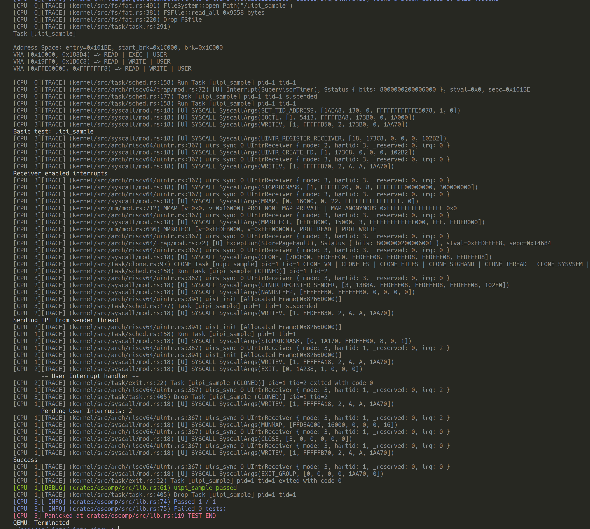

# Kernel 和 Libc 实现

## tCore 实现

在 trap return 时对控制寄存器进行写入，并根据 UINTC 中的 pending 位来判断是否在返回用户态时立刻触发用户态中断处理：

```rust
pub unsafe fn uirs_sync() {
    let uintr_inner = cpu().curr.as_ref().unwrap().uintr_inner();
    if let Some(uirs) = &uintr_inner.uirs {
        let index = uirs.0;
        let mut uirs = UIntrReceiver::from(index);
        uirs.hartid = get_cpu_id() as u16;
        uirs.mode |= 0x2; // 64 bits
        uirs.sync(index);

        log::trace!("uirs_sync {:x} {:x?}", index, uirs);

        // user configurations
        utvec::write(uintr_inner.utvec, utvec::TrapMode::Direct);
        uscratch::write(uintr_inner.uscratch);
        uie::set_usoft();

        // supervisor configurations
        suirs::write((1 << 63) | (index & 0xffff));
        sideleg::set_usoft();
        if uirs.irq != 0 {
            sip::set_usoft();
        } else {
            sip::clear_usoft();
        }
    } else {
        // supervisor configurations
        suirs::write(0);
        sideleg::clear_usoft();
        sip::clear_usoft();
    }
}

pub fn uist_init() {
    let curr = cpu().curr.as_ref().unwrap();
    if let Some(uist) = &curr.uintr_inner().uist {
        log::trace!("uist_init {:x?}", uist.frames);

        uintr::suist::write(
            (1 << 63) | (1 << 44) | uist.frames.first().unwrap().start_address().value(),
        );
    }
}
```

有几处需要注意的地方：

- 没有处理 ustatus，因为已经在 trap 上下文中保存了 ustatus；
- uie 默认会被设置成 1，因为实际的中断触发条件是通过 ustatus.uie 来屏蔽的；
- utvec 和 uscratch 由用户设置，保存在 TCB 中，每次返回用户态前重新设置；
- suirs 写入待返回用户对应的 index；
- sideleg 将用户软件中断委托给用户态处理；

虽然在这里将 sip 里对应位设置为 1 ，但由于 qemu 的中断是写 mip 这一时刻才判断是否触发的，因此其他触发条件并不能被即使响应，这里特权态为 S 态；我们期望从 sret 执行完的下一条指令立即陷入用户态中断处理函数，sret 会将特权态设为 U 态，满足触发条件，需要对 qemu 进行修改，在 sret 的 helper 中加入如下代码，相当于在 sret 的处理过程中模拟了中断的触发：

```c
if (riscv_has_ext(env, RVN)
    && prev_priv == PRV_U
    && get_field(env->mip, MIP_USIP)
    && get_field(env->mstatus, MSTATUS_UIE)
    && get_field(env->sideleg, MIP_USIP)) {
    qemu_log("raise user interrupt %lx\n", env->utvec);
    retpc = env->utvec;
    env->uepc = env->sepc;

    mstatus = env->mstatus;
    mstatus = set_field(mstatus, MSTATUS_UPIE, 1);
    mstatus = set_field(mstatus, MSTATUS_UIE, 0);
    env->mstatus = mstatus;
}
```

此外，考虑到用户可能想通过多次执行处理函数来完依次完成 pending 位的处理和清空，在 uret 中也加入了类似的实现，如果用户不在处理函数中清空 uip 或在执行处理函数的过程中有新的中断发过来（假设没有在处理函数中执行 uipi_deactivate），uret 执行完的下一条指令就会再次陷入用户态中断处理函数：

```c
 if (riscv_has_ext(env, RVN)
    && prev_priv == PRV_U
    && get_field(env->mip, MIP_USIP)
    && get_field(env->mstatus, MSTATUS_UIE)
    && get_field(env->sideleg, MIP_USIP)) {
    qemu_log("raise user interrupt %lx\n", env->utvec);
    retpc = env->utvec;

    mstatus = env->mstatus;
    mstatus = set_field(mstatus, MSTATUS_UPIE, 1);
    mstatus = set_field(mstatus, MSTATUS_UIE, 0);
    env->mstatus = mstatus;
}
```

注意这里增加的实现只是为了保证功能正确性，在实际的硬件中，中断触发的各种条件会被 and 在一起，任何一个条件从低拉到高都可以。

### Syscall 实现

不管是作为接收方还是发送方，都需要内核分配物理资源，并对这些资源的生命周期进行管理；在 TCB 中加入如下字段：

```rust
pub struct TaskUIntrInner {
    /// Sender status
    pub uist: Option<UIntrSender>,

    /// Receiver status
    pub uirs: Option<UIntrReceiverTracker>,

    /// Sender vector mask
    pub mask: u64,

    /// User interrupt entry
    pub utvec: usize,

    /// User interrupt handler
    pub uscratch: usize,
}

/// User interrupt sender status.
pub struct UIntrSender {
    /// Maximum number of frames.
    limit: usize,

    /// Sender status table allocator.
    alloc: RecycleAllocator,

    /// Frame allocated for send status table
    frames: Vec<AllocatedFrame>,
}

pub struct UIntrReceiver {
    /// Kernel defined architecture mode and valid bit.
    mode: u16,

    /// The integer ID of the hardware thread running the code.
    hartid: u16,

    /// Reserved bits.
    _reserved: u32,

    /// One bit for each user interrupt vector. There is user-interrupt request for a vector if the corresponding bit is 1.
    irq: u64,
}
```

声明全局分配器来分配接收方的槽位：

```rust
static UINTR_RECEIVER_ALLOC: Lazy<SpinLock<RecycleAllocator>> =
    Lazy::new(|| SpinLock::new(RecycleAllocator::new(0)));

pub struct UIntrReceiverTracker(pub usize);

impl UIntrReceiverTracker {
    pub fn new() -> Self {
        let new = UINTR_RECEIVER_ALLOC.lock().alloc();
        assert!(new < 512);
        Self(new)
    }
}

impl Drop for UIntrReceiverTracker {
    fn drop(&mut self) {
        UINTR_RECEIVER_ALLOC.lock().dealloc(self.0);
    }
}
```

`sys_uintr_register_receiver` 用来注册接收方：

```rust
 pub fn uintr_register_receier() -> SyscallResult {
    let curr = cpu().curr.as_ref().unwrap();

    if curr.uintr_inner().uirs.is_some() {
        return Err(Errno::EINVAL);
    }

    curr.uintr_inner().uirs = Some(UIntrReceiverTracker::new());

    // Flush pending bits (low bits will be set during trap return).
    let uintr_inner = curr.uintr_inner();

    // Initialize receiver status in UINTC
    let index = uintr_inner.uirs.as_ref().unwrap().0;
    let mut uirs = UIntrReceiver::from(index);
    uirs.irq = 0;
    uirs.sync(index);

    // Save user status
    uintr_inner.utvec = uintr::utvec::read().bits();
    uintr_inner.uscratch = uintr::uscratch::read();

    Ok(0)
}
```

`sys_uintr_register_sender` 用来注册发送方：

```rust
pub fn uintr_register_sender(fd: usize) -> SyscallResult {
    let curr = cpu().curr.as_ref().unwrap();
    let file = curr.files().get(fd)?;
    if file.is_uintr() {
        if curr.uintr_inner().uist.is_none() {
            curr.uintr_inner().uist = Some(UIntrSender::new(1));
        }

        let uist = curr.uintr_inner().uist.as_mut().unwrap();
        if let Some(index) = uist.alloc() {
            let uiste = uist.get(index).unwrap();
            let file = file.as_any().downcast_ref::<UIntrFile>().unwrap();
            uiste.set_valid(true);
            uiste.set_vec(file.vector);
            uiste.set_index(file.uirs_index);
            return Ok(index);
        } else {
            return Err(Errno::EINVAL);
        }
    }
    Err(Errno::EINVAL)
}
```

`sys_uintr_create_fd` 用来为发送方分配 vector：

```rust
pub fn uintr_create_fd(vector: usize) -> SyscallResult {
    let curr = cpu().curr.as_ref().unwrap();
    if let Some(uirs) = &curr.uintr_inner().uirs {
        if !curr.uintr_inner().mask.get_bit(vector) {
            curr.uintr_inner().mask.set_bit(vector, true);
            let fd = curr.files().push(Arc::new(UIntrFile {
                uirs_index: uirs.0,
                vector,
            }))?;
            return Ok(fd);
        } else {
            return Err(Errno::EINVAL);
        }
    }
    Err(Errno::EINVAL)
}
```

fd 通过 `sys_clone` 系统调用在发送方和接收方之间共享。

## Libc

为接收方的处理函数提供上下文切换的封装：

```asm
    .section .text
    .align 4
    .globl uintrvec
uintrvec:
    # allocate stack space
    addi sp, sp, -248
    
    # save the user registers in TRAPFRAME
    sd ra, 0(sp)
    sd gp, 16(sp)
    sd tp, 24(sp)
    sd t0, 32(sp)
    sd t1, 40(sp)
    sd t2, 48(sp)
    sd s0, 56(sp)
    sd s1, 64(sp)
    sd a0, 72(sp)
    sd a1, 80(sp)
    sd a2, 88(sp)
    sd a3, 96(sp)
    sd a4, 104(sp)
    sd a5, 112(sp)
    sd a6, 120(sp)
    sd a7, 128(sp)
    sd s2, 136(sp)
    sd s3, 144(sp)
    sd s4, 152(sp)
    sd s5, 160(sp)
    sd s6, 168(sp)
    sd s7, 176(sp)
    sd s8, 184(sp)
    sd s9, 192(sp)
    sd s10, 200(sp)
    sd s11, 208(sp)
    sd t3, 216(sp)
    sd t4, 224(sp)
    sd t5, 232(sp)
    sd t6, 240(sp)

    # jump to user handler
    mv a0, sp
    csrr a1, uscratch
    jal __handler_entry

    .align 4
    .globl uintrret
uintrret:
    # restore the user registers in TRAPFRAME
    ld ra, 0(sp)
    ld gp, 16(sp)
    ld tp, 24(sp)
    ld t0, 32(sp)
    ld t1, 40(sp)
    ld t2, 48(sp)
    ld s0, 56(sp)
    ld s1, 64(sp)
    ld a0, 72(sp)
    ld a1, 80(sp)
    ld a2, 88(sp)
    ld a3, 96(sp)
    ld a4, 104(sp)
    ld a5, 112(sp)
    ld a6, 120(sp)
    ld a7, 128(sp)
    ld s2, 136(sp)
    ld s3, 144(sp)
    ld s4, 152(sp)
    ld s5, 160(sp)
    ld s6, 168(sp)
    ld s7, 176(sp)
    ld s8, 184(sp)
    ld s9, 192(sp)
    ld s10, 200(sp)
    ld s11, 208(sp)
    ld t3, 216(sp)
    ld t4, 224(sp)
    ld t5, 232(sp)

    # restore stack pointer
    addi sp, sp, 248

    # return to normal pc
    uret
```

系统调用接口被封装在 `__register_receiver` 中，这个函数还会将 `uintrvec` 和 `handler` 写入到 CSR 中，同时设置UINTC 中的 valid 位。

```c
extern void __handler_entry(struct __uintr_frame* frame, void* handler) {
  uint64_t irqs = uipi_read();

  uint64_t (*__handler)(struct __uintr_frame * frame, uint64_t) = handler;
  irqs = __handler(frame, irqs);

  uipi_write(irqs);
  csr_clear(CSR_UIP, MIE_USIE);
}

static uint64_t __register_receiver(void* handler) {
  // set user interrupt entry
  csr_write(CSR_UTVEC, uintrvec);
  csr_write(CSR_USCRATCH, handler);

  // enable U-mode interrupt handler
  csr_set(CSR_USTATUS, USTATUS_UIE);
  csr_set(CSR_UIE, MIE_USIE);

  int ret;
  ret = __syscall0(__NR_uintr_register_receiver);

  // enable UINTC
  uipi_activate();

  return ret;
}
```

最后运行结果如下：


